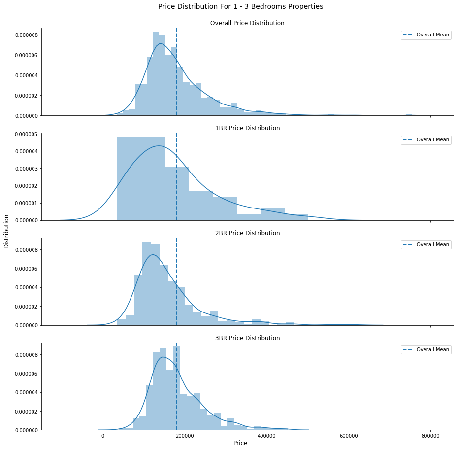
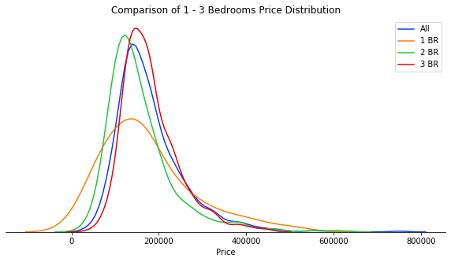
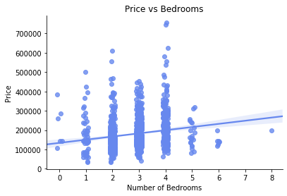
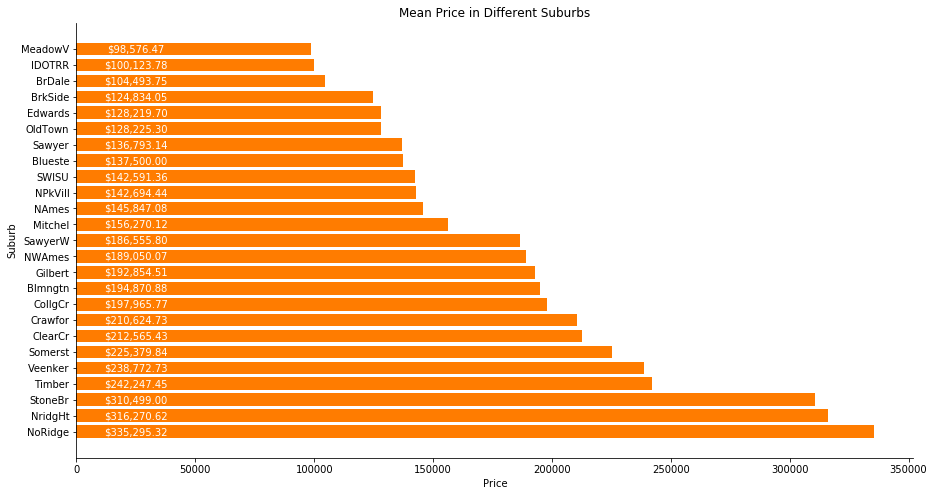
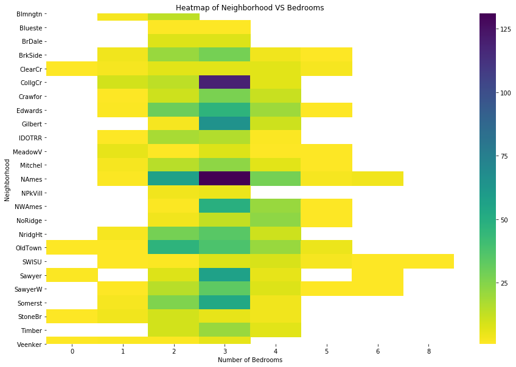
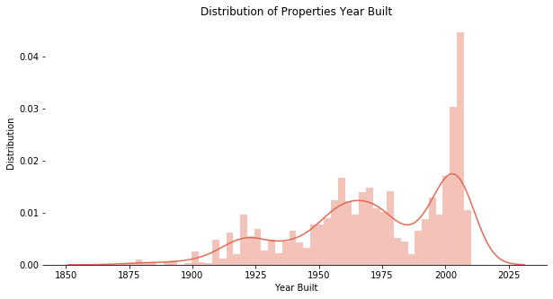
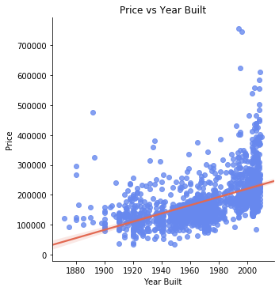

# US House Price Analysis

## Dataset

This project uses the Ames Housing dataset http://jse.amstat.org/v19n3/decock.pdf

The dataset is available on Kaggle https://www.kaggle.com/c/house-prices-advanced-regression-techniques/data

The train data contains 1460 rows with 81 columns, and the test data contain 1459 and 80 columns (minus the target column)

### Quality

There are a number of columns with missing values such as `LotFrontage, Alley and Fence`, however, these missing values might not be an indication of error, it might be that the property simply does not have a fence for example. As such, we need to take great care in imputing these missing values. This is discussed in more detail inside the `train` notebook

There doesn't seem to be any other data issue other than missing values

## Visualization

### Price Distribution for 1 - 3 Bedrooms

We will start with looking at how the number of bedrooms affect the properties price. Below is a chart for each of 1 - 3 Bedrooms properties price distribution.

It is unexpected to see that they all have similar prices despite the different in number of bedrooms. We will investigate this further.

From the combined distribution chart, we could see that the 2 bedrooms properties (green) actually have lower mean in the price distribution compared to properties with 1 bedrooms (orange). However, the scatter plot of price vs bedrooms shows that there is a direct relationship between the variables. This indicates that **number of bedrooms is not the only factor** in determining the property price.

Intuition tells that perhaps properties with 2 bedrooms are located farther away from the CBD where land price is cheaper, hence larger properties size.

### Mean Price in Different Suburbs (Neighborhood)

The least expensive suburb is Meadow Vale (MeadowV) and the most expensive is North Ridge. It is astounding that the mean price difference is more than 3 times

### Heatmap of Number of Bedrooms of Properties for Different Neighborhood

From the heatmap, we could understand on why North Ridge can have the highest mean in properties prices, the suburb is dominated by 4 bedroom properties, while Meadow Vale has a more balanced distribution.

We can also see why 2BR properties have smaller mean compared to 1BR properties (previous Price Distribution chart), the majority of 2BR properties are located in North Ames and Old Town, which are among the least expensive neighborhood.

### Year Built

The histogram seems to be trimodal, with peak at around 1910, 1960, and 2010. There is something intriguing about how the **peaks are roughly 50 years apart**. Perhaps people are selling properties that they inherit? Which arguably might happen every 50 years. Is there a major construction cycle every 50 years? This will need more data and further investigation.

The scatter plot  suggest a direct relationship between price and year built. Year built can be a good indicator for price.

## Regression Model

In this project, 4 different prediction models were built.

### Model 1

Model 1 is the simplest with minimal features. The aim is to quickly built a model and get result that can be used as a benchmark model. 

Model 1 uses only 7 features, `'LotFrontage', 'LotArea', 'BedroomAbvGr', 'FullBath', 'HalfBath', 'YearBuilt', 'GarageCars'` with no preprocessing and a linear regression model.

The model achieved a 3-fold cross-validation MAE of $36,853.7

### Model 2

Model 2 is Model 1 with more categorical features, it adds `'Neighborhood', 'MSZoning', 'OverallQual', 'OverallCond'` with one-hot encoding.

Model 2 achieved a 3-fold cross-validation MAE of $23,225.8 which is a great improvement

### Model 3

As the numerical features have different scale, model 3 introduces a scaler for the numerical features. Model 3 is model 2 with a Normalizer introduced in the numerical columns pipeline

However, model 3 achieved a worse result than model 2. The 3-fold cross-validation MAE is $24,569.7

### Model 4

Model 4 is an improvement of model 2, with XGBoost as the regressor.

Model 4 achieved a 3-fold cross-validation MAE of $22,674.6 which is the best model so far

